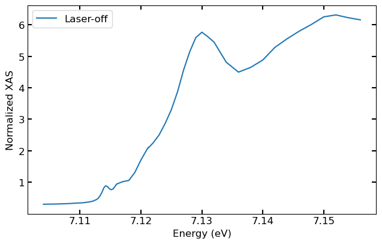
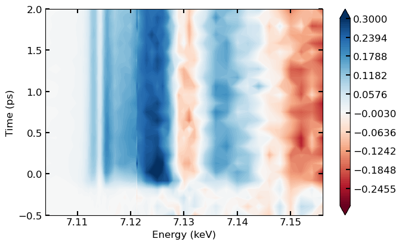

## Importing Dependencies

XSpecT relies on a number of common python packages including:  

- [h5py](https://www.h5py.org/) for reading HDF5 files
- [NumPy](https://numpy.org/) and scipy for data analysis
- [Matplotlib](https://matplotlib.org/) for visualization
- Other system related packages

Depending on your system you may need to install the necessary
dependencies. S3DF users should have the necessary packages by default.

``` py
import h5py
import numpy as np
import matplotlib.pyplot as plt
from scipy.ndimage import rotate
from scipy.interpolate import interp1d
from scipy.optimize import curve_fit,minimize
import multiprocessing
import os
from functools import partial
import time
import sys
import argparse
from datetime import datetime
import tempfile
```

## Importing XSPecT Modules

XSpecT has several main modules for function to control various aspects
of the analysis, visualization, diagnostics and overall processing.

``` py
sys.path.insert(0, './XSpecT/')
import XSpect.XSpect_Analysis
import XSpect.XSpect_Controller
import XSpect.XSpect_Visualization
import XSpect.XSpect_PostProcessing
import XSpect.XSpect_Diagnostics
```

## XAS Analysis Example

### Setting up experiment parameters

Initializing the `spectroscopy_experiment` class and setting the relevant
experiment information`lslc_run`, `hutch`, and `experiment_id`
parameters.

``` py
xas_experiment = XSpect.XSpect_Analysis.spectroscopy_experiment(lcls_run=22, hutch='xcs', experiment_id='xcsl1030422')
```

These values will be used to obtain the directory for the data which is
stored in `experiment_directory`:

``` py
xas_experiment.experiment_directory
```

    '/sdf/data/lcls/ds/xcs/xcsl1030422/hdf5/smalldata'

### XASBatchAnalysis Class

Instantiating the `XASBatchAnalysis` class which allows you to set
attributes relevant to the analysis such as the HDF5 group keys for the
various datasets, filter thresholds, and timing/energy parameters. The
class also contain an analysis pipeline method, which controls the
sequence of analysis operations.

``` py
xas=XSpect.XSpect_Controller.XASBatchAnalysis()
```

#### Setting keys and aliases

The keys, which specify the data to read from the HDF5 file, are defined
as a list of strings. For pump-probe XAS measurements this typically
includes: 

- The monochromator energy and set values (epics/ccm_E, epicsUser/ccm_E\_setpoint)
- TT correction values and amplitude (tt/ttCorr, tt/AMPL)
- Timing stage values (epics/lxt_ttc)
- Emission CCD detecotr ROI sum values (epix_2/ROI_0\_sum)
- Normalization channel (ipm4/sum).

Their "friendly" names serve as an easier to remember alias for the keys and are also defined as a list of strings with the same ordering as the keys.
These lists are passed to `set_key_aliases` which creates the key aliases.

``` py
keys=['epics/ccm_E', 'epicsUser/ccm_E_setpoint', 'tt/ttCorr', 'epics/lxt_ttc', 'enc/lasDelay', 'ipm4/sum', 'tt/AMPL', 'epix_2/ROI_0_sum'] 
names=['ccm', 'ccm_E_setpoint', 'time_tool_correction', 'lxt_ttc', 'encoder', 'ipm', 'time_tool_ampl', 'epix']
xas.set_key_aliases(keys,names)
```

#### Adding filters

Filters are set using `add_filter` which takes requires the parameters
\'shot_type\' (e.g. xray, simultaneous), \'filter_key\' (i.e. which
dataset to apply the filter to), and the filter threshold.

``` py
xas.add_filter('xray','ipm',500.0)
xas.add_filter('simultaneous','ipm',500.0)
xas.add_filter('simultaneous','time_tool_ampl',0.01)
```

#### Setting runs

Multiple runs (files) can be analyzed and combined into a single data set using the `run_parser` method. 
Specify the runs as a list of strings or as a single string with space separated run numbers. 
Ranges can be specified using numbers separated by a "-".

``` py
xas.run_parser(['240-243 245-254'])
```

#### Setting timing parameters

Delay timing range and number of points is set in picoseconds.

``` py
xas.mintime = -0.5
xas.maxtime = 2.0
xas.numpoints = 25
```

#### Normalization option

Normalization is set by default (False) to use an IPM sum dataset.
Alternatively, the scattering liquid ring signal can be used:

``` py
xas.scattering = True
```

### Running Analysis Loop

With the necessary parameters set the analysis procedure can be
initiatilized. Here you pass the experiment attributes from
`xas_experiment`. For details of the step by step analysis processes set
`verbose= True ` (False is the default).

``` py
xas.primary_analysis_loop(xas_experiment, verbose=True)
```

    Obtained shot properties
    HDF5 import of keys completed. Time: 0.02 seconds
    Mask: xray has been filtered on ipm by minimum threshold: 500.000
    Shots removed: 2645
    Mask: simultaneous has been filtered on ipm by minimum threshold: 500.000
    Shots removed: 1904
    Mask: simultaneous has been filtered on time_tool_ampl by minimum threshold: 0.010
    Shots removed: 100
    Shots combined for detector epix on filters: simultaneous and laser into epix_simultaneous_laser
    Shots (12182) separated for detector epix on filters: xray and laser into epix_xray_laser
    Shots combined for detector ipm on filters: simultaneous and laser into ipm_simultaneous_laser
    Shots (12182) separated for detector ipm on filters: xray and laser into ipm_xray_laser
    Shots combined for detector ccm on filters: simultaneous and laser into ccm_simultaneous_laser
    Shots (12182) separated for detector ccm on filters: xray and laser into ccm_xray_laser
    Generated timing bins from -0.500000 to 2.000000 in 25 steps.
    Generated ccm bins from 7.105000 to 7.156500 in 54 steps.
    Shots combined for detector timing_bin_indices on filters: simultaneous and laser into timing_bin_indices_simultaneous_laser
    Shots (12182) separated for detector timing_bin_indices on filters: xray and laser into timing_bin_indices_xray_laser
    Shots combined for detector ccm_bin_indices on filters: simultaneous and laser into ccm_bin_indices_simultaneous_laser
    Shots (12182) separated for detector ccm_bin_indices on filters: xray and laser into ccm_bin_indices_xray_laser
    Detector epix_simultaneous_laser binned in time into key: epix_simultaneous_laser_time_energy_binned
    Detector epix_xray_not_laser binned in time into key: epix_xray_not_laser_time_energy_binned
    Detector ipm_simultaneous_laser binned in time into key: ipm_simultaneous_laser_time_energy_binned
    Detector ipm_xray_not_laser binned in time into key: ipm_xray_not_laser_time_energy_binned
    Obtained shot properties
    HDF5 import of keys completed. Time: 0.03 seconds
    ...

#### Exploring Analyzed Runs

The data for each run is stored in `analyzed_runs` list.

``` py
xas.analyzed_runs
```

    [<XSpect.XSpect_Analysis.spectroscopy_run at 0x7febe6d2ea00>,
     <XSpect.XSpect_Analysis.spectroscopy_run at 0x7febe6de1d00>,
     <XSpect.XSpect_Analysis.spectroscopy_run at 0x7febe71fe580>,
     <XSpect.XSpect_Analysis.spectroscopy_run at 0x7febe6fab670>,
     <XSpect.XSpect_Analysis.spectroscopy_run at 0x7febe75ac550>,
     <XSpect.XSpect_Analysis.spectroscopy_run at 0x7febe75c4280>,
     <XSpect.XSpect_Analysis.spectroscopy_run at 0x7febe6fc07f0>,
     <XSpect.XSpect_Analysis.spectroscopy_run at 0x7febe6d2b1f0>,
     <XSpect.XSpect_Analysis.spectroscopy_run at 0x7febe6d2b460>,
     <XSpect.XSpect_Analysis.spectroscopy_run at 0x7febe6fb5e80>,
     <XSpect.XSpect_Analysis.spectroscopy_run at 0x7febe6fb53d0>,
     <XSpect.XSpect_Analysis.spectroscopy_run at 0x7febe6d2b9d0>,
     <XSpect.XSpect_Analysis.spectroscopy_run at 0x7febe6b00c10>,
     <XSpect.XSpect_Analysis.spectroscopy_run at 0x7febe72de340>]

We can check the data shape for the laser-off shots first analyzed run,
which has the dimensions of 25 time bins by 54 energy bins.

``` py
print("Data shape:", xas.analyzed_runs[0].epix_xray_not_laser_time_energy_binned.shape)
```

    Data shape: (25, 54)

Since the laser the laser is off, we can average across all time bins for the epix and normalization channels.

``` py
y = np.average(xas.analyzed_runs[0].epix_xray_not_laser_time_energy_binned, axis = 0)
norm = np.average(xas.analyzed_runs[0].ipm_xray_not_laser_time_energy_binned, axis =0)
```

#### Plotting Laser-off Spectrum

Then the laser off spectrum can be plotted versus the monochromator energies.

``` py
plt.plot(xas.analyzed_runs[0].ccm_energies, y/norm, label="Laser-off")
plt.xlabel("Energy (eV)")
plt.ylabel("Normalized XAS")
plt.legend()
```



#### Plotting 2D Spectra

The 2D (time versus energy) data can be summed and plotted using the XSpecT visualation module. 
First, from visualization the `XASVisualization` object is instantiated. 
Then, using the `combine_spectra` method and passing the `xas` data object and the necessary data keys the data is processed.

``` py
v=XSpect.XSpect_Visualization.XASVisualization()
v.combine_spectra(xas_analysis=xas,
                  xas_laser_key='epix_simultaneous_laser_time_energy_binned',
                  xas_key='epix_xray_not_laser_time_energy_binned',
                  norm_laser_key='ipm_simultaneous_laser_time_energy_binned',
                  norm_key='ipm_xray_not_laser_time_energy_binned')
```

Finally, the 2D spectrum can be plotted, setting vmin and vmax colorbar
parameters as needed.

``` py
v.plot_2d_difference_spectrum(xas, vmin=-0.3, vmax=0.3)
```


