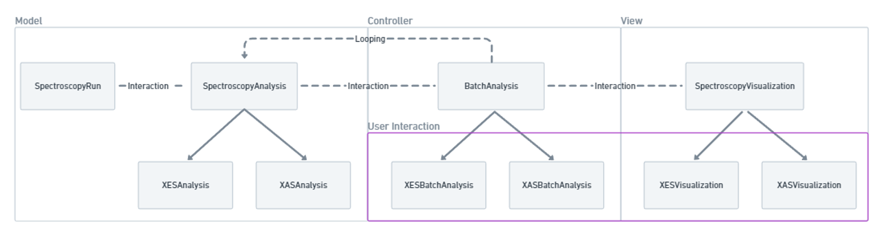

# Overview

XSpecT follows the principles of [Model-View-Controller](https://en.wikipedia.org/wiki/Model%E2%80%93view%E2%80%93controller) in its design. It is written in [python](https://www.python.org/) following the object-oriented programming paradigm. It is designed for analyzing X-ray absorption and emission spectroscopy data at X-ray free electron lasers and is currently in use at the [LCLS](https://lcls.slac.stanford.edu/). 

The XSPecT code is comprised of several main modules designed to handle the analysis, visualization and control processes. The controller handles i/o, analysis pipelines and parallelization. The analysis module performs the data manipulations (e.g. filtering, sorting and mathematical operations). The visualization module provides methods to easily generate 2D difference maps and other plots of interest. 

The over process is depicted in the following figure:

